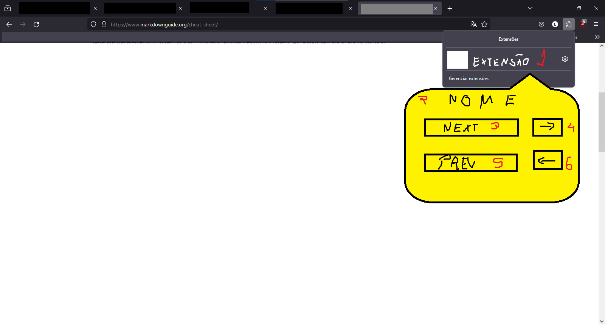

# MangaReader

É um projeto simples de uma extensão para Firefox que, à comando do usuário, irá detectar o elemento html clicado e salvará a tag, classe e id (se houver) em um JSON junto da URL da página. Dessa forma, pretendo permitir que o usuário atribua teclas para passar e voltar páginas. Imagino que já exista algo assim feito mais profissionalmente mas eu quero um meu feito especificamente pros sites ~~piratas~~ de mangá.

# Características Básicas

- Manifest V3
- Toolbar Icon
- POP UP

## Estrutura Básica

A estrutura básica do projeto é um ícone na toolbar ativado por **action** que abrirá um pop up com botões para iniciar a coleta de cada uma das informações. 

Onde

 1. Action Button
 2. Pop Up Body
 3. Record Tag Next Chapter
 4. Record Key For Tag Next
 5. Record Tag Previous Chapter
 6. Record Key For Tag Previous

Os botões dos itens 4 e 6 devem mostrar a tecla de atalho atual.